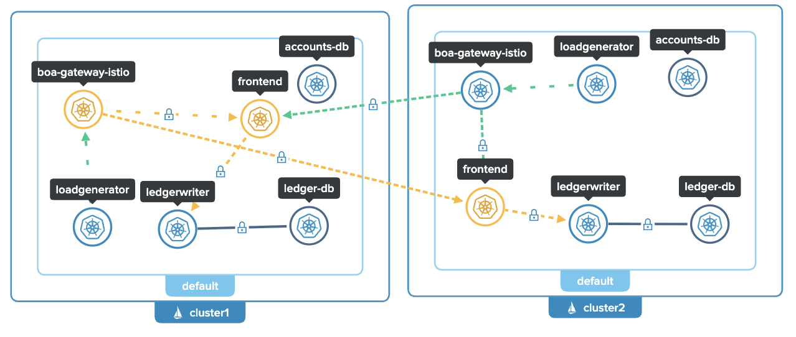

### ENV

Deploy two Kubernetes clusters and then continue.

```
export CLUSTER1=cluster1
export CLUSTER2=cluster2
export GLOO_MESH_LICENSE_KEY=<update>  # UPDATE THIS

export ISTIO_VERSION=1.26.2
export REPO_KEY=d4cba2aff3ef
export ISTIO_IMAGE=${ISTIO_VERSION}-solo
export REPO=us-docker.pkg.dev/gloo-mesh/istio-${REPO_KEY}
export HELM_REPO=us-docker.pkg.dev/gloo-mesh/istio-helm-${REPO_KEY}
```

Download Solo's 1.26.2 istioctl Binary:

```
OS=$(uname | tr '[:upper:]' '[:lower:]' | sed -E 's/darwin/osx/')
ARCH=$(uname -m | sed -E 's/aarch/arm/; s/x86_64/amd64/; s/armv7l/armv7/')

mkdir -p ~/.istioctl/bin
curl -sSL https://storage.googleapis.com/istio-binaries-d4cba2aff3ef/1.26.0-solo/istioctl-1.26.0-solo-${OS}-${ARCH}.tar.gz | tar xzf - -C ~/.istioctl/bin
chmod +x ~/.istioctl/bin/istioctl

export PATH=${HOME}/.istioctl/bin:${PATH}
```

### Configure trust

```
for context in ${CLUSTER1} ${CLUSTER2}; do
  kubectl --context=${context} create ns istio-system || true
  kubectl --context=${context} create ns istio-gateways || true
done
kubectl --context=${CLUSTER1} create secret generic cacerts -n istio-system \
--from-file=./certs/cluster1/ca-cert.pem \
--from-file=./certs/cluster1/ca-key.pem \
--from-file=./certs/cluster1/root-cert.pem \
--from-file=./certs/cluster1/cert-chain.pem
kubectl --context=${CLUSTER2} create secret generic cacerts -n istio-system \
--from-file=./certs/cluster2/ca-cert.pem \
--from-file=./certs/cluster2/ca-key.pem \
--from-file=./certs/cluster2/root-cert.pem \
--from-file=./certs/cluster2/cert-chain.pem
```

### Install Istio CRDs

```
helm upgrade --install istio-base oci://${HELM_REPO}/base \
--namespace istio-system \
--kube-context ${CLUSTER1} \
--create-namespace \
--version ${ISTIO_IMAGE} \
-f - <<EOF
defaultRevision: ""
profile: ambient
EOF
```

```
helm upgrade --install istio-base oci://${HELM_REPO}/base \
--namespace istio-system \
--kube-context ${CLUSTER2} \
--create-namespace \
--version ${ISTIO_IMAGE} \
-f - <<EOF
defaultRevision: ""
profile: ambient
EOF
```

Apply the CRDs for the Kubernetes Gateway API to your cluster, which are required to create components such as waypoint proxies for L7 traffic policies, gateways with the Gateway resource, and more.

```
kubectl --context $CLUSTER1 apply -f https://github.com/kubernetes-sigs/gateway-api/releases/download/v1.2.1/standard-install.yaml
kubectl --context $CLUSTER2 apply -f https://github.com/kubernetes-sigs/gateway-api/releases/download/v1.2.1/standard-install.yaml
```

Install istiod on cluster1 and cluster2

```
helm upgrade --install istiod oci://${HELM_REPO}/istiod \
--namespace istio-system \
--kube-context ${CLUSTER1} \
--version ${ISTIO_IMAGE} \
-f - <<EOF
env:
  # Assigns IP addresses to multicluster services
  PILOT_ENABLE_IP_AUTOALLOCATE: "true"
  # Disable selecting workload entries for local service routing.
  # Required for Gloo VirtualDestinaton functionality.
  # PILOT_ENABLE_K8S_SELECT_WORKLOAD_ENTRIES: "false"
  # Required when meshConfig.trustDomain is set
  PILOT_SKIP_VALIDATE_TRUST_DOMAIN: "true"
global:
  hub: ${REPO}
  multiCluster:
    clusterName: cluster1
  network: cluster1
  proxy:
    clusterDomain: cluster.local
  tag: ${ISTIO_IMAGE}
istio_cni:
  namespace: istio-system
  enabled: true
meshConfig:
  accessLogFile: /dev/stdout
  defaultConfig:
    proxyMetadata:
      ISTIO_META_DNS_AUTO_ALLOCATE: "true"
      ISTIO_META_DNS_CAPTURE: "true"
# Required to enable multicluster support
platforms:
  peering:
    enabled: true
profile: ambient
license:
    value: ${GLOO_MESH_LICENSE_KEY}
EOF
```

```
helm upgrade --install istiod oci://${HELM_REPO}/istiod \
--namespace istio-system \
--kube-context ${CLUSTER2} \
--version ${ISTIO_IMAGE} \
-f - <<EOF
env:
  # Assigns IP addresses to multicluster services
  PILOT_ENABLE_IP_AUTOALLOCATE: "true"
  # Disable selecting workload entries for local service routing.
  # Required for Gloo VirtualDestinaton functionality.
  PILOT_ENABLE_K8S_SELECT_WORKLOAD_ENTRIES: "false"
  # Required when meshConfig.trustDomain is set
  PILOT_SKIP_VALIDATE_TRUST_DOMAIN: "true"
global:
  hub: ${REPO}
  multiCluster:
    clusterName: cluster2
  network: cluster2
  proxy:
    clusterDomain: cluster.local
  tag: ${ISTIO_IMAGE}
istio_cni:
  namespace: istio-system
  enabled: true
meshConfig:
  accessLogFile: /dev/stdout
  defaultConfig:
    proxyMetadata:
      ISTIO_META_DNS_AUTO_ALLOCATE: "true"
      ISTIO_META_DNS_CAPTURE: "true"
# Required to enable multicluster support
platforms:
  peering:
    enabled: true
profile: ambient
license:
    value: ${GLOO_MESH_LICENSE_KEY}
EOF
```

Install istio-cni on cluster1 and cluster2.

```
helm upgrade --install istio-cni oci://${HELM_REPO}/cni \
--namespace istio-system \
--kube-context ${CLUSTER1} \
--version ${ISTIO_IMAGE} \
-f - <<EOF
# Assigns IP addresses to multicluster services
ambient:
  dnsCapture: true
excludeNamespaces:
  - istio-system
  - kube-system
global:
  hub: ${REPO}
  tag: ${ISTIO_IMAGE}
  variant: distroless
profile: ambient
EOF
```

```
helm upgrade --install istio-cni oci://${HELM_REPO}/cni \
--namespace istio-system \
--kube-context ${CLUSTER2} \
--version ${ISTIO_IMAGE} \
-f - <<EOF
# Assigns IP addresses to multicluster services
ambient:
  dnsCapture: true
excludeNamespaces:
  - istio-system
  - kube-system
global:
  hub: ${REPO}
  tag: ${ISTIO_IMAGE}
  variant: distroless
profile: ambient
EOF
```

Install ztunnel on cluster1 and cluster2

```
helm upgrade --install ztunnel oci://${HELM_REPO}/ztunnel \
--namespace istio-system \
--kube-context ${CLUSTER1} \
--version ${ISTIO_IMAGE} \
-f - <<EOF
configValidation: true
enabled: true
env:
  L7_ENABLED: "true"
  # Required when a unique trust domain is set for each cluster
  SKIP_VALIDATE_TRUST_DOMAIN: "true"
hub: ${REPO}
multiCluster:
  clusterName: cluster1
tag: ${ISTIO_IMAGE}
istioNamespace: istio-system
namespace: istio-system
network: cluster1
profile: ambient
proxy:
  clusterDomain: cluster.local
terminationGracePeriodSeconds: 29
variant: distroless
EOF
```

```
helm upgrade --install ztunnel oci://${HELM_REPO}/ztunnel \
--namespace istio-system \
--kube-context ${CLUSTER2} \
--version ${ISTIO_IMAGE} \
-f - <<EOF
configValidation: true
enabled: true
env:
  L7_ENABLED: "true"
  # Required when a unique trust domain is set for each cluster
  SKIP_VALIDATE_TRUST_DOMAIN: "true"
hub: ${REPO}
multiCluster:
  clusterName: cluster2
tag: ${ISTIO_IMAGE}
istioNamespace: istio-system
namespace: istio-system
network: cluster2
profile: ambient
proxy:
  clusterDomain: cluster.local
terminationGracePeriodSeconds: 29
variant: distroless
EOF
```

```
kubectl label namespace istio-system --context ${CLUSTER1} topology.istio.io/network=cluster1
kubectl label namespace istio-system --context ${CLUSTER2} topology.istio.io/network=cluster2
```

### Peer the clusters together

Expose using an east-west gateway:

#### Istioctl

```
istioctl --context=${CLUSTER1} multicluster expose --wait -n istio-gateways
istioctl --context=${CLUSTER2} multicluster expose --wait -n istio-gateways
```

#### YAML

```
kubectl apply --context $CLUSTER1 -f- <<EOF
apiVersion: gateway.networking.k8s.io/v1
kind: Gateway
metadata:
  labels:
    istio.io/expose-istiod: "15012"
    topology.istio.io/network: cluster1
  name: istio-eastwest
  namespace: istio-gateways
spec:
  gatewayClassName: istio-eastwest
  listeners:
  - name: cross-network
    port: 15008
    protocol: HBONE
    tls:
      mode: Passthrough
  - name: xds-tls
    port: 15012
    protocol: TLS
    tls:
      mode: Passthrough
EOF
```

```
kubectl apply --context $CLUSTER2 -f- <<EOF
apiVersion: gateway.networking.k8s.io/v1
kind: Gateway
metadata:
  labels:
    istio.io/expose-istiod: "15012"
    topology.istio.io/network: cluster2
  name: istio-eastwest
  namespace: istio-gateways
spec:
  gatewayClassName: istio-eastwest
  listeners:
  - name: cross-network
    port: 15008
    protocol: HBONE
    tls:
      mode: Passthrough
  - name: xds-tls
    port: 15012
    protocol: TLS
    tls:
      mode: Passthrough
EOF
```

Link clusters together:

#### Istioctl

`istioctl multicluster link --contexts=$CLUSTER1,$CLUSTER2 -n istio-gateways`

#### YAML

```
export CLUSTER1_EW_ADDRESS=$(kubectl get svc -n istio-gateways istio-eastwest --context $CLUSTER1 -o jsonpath="{.status.loadBalancer.ingress[0]['hostname','ip']}")
export CLUSTER2_EW_ADDRESS=$(kubectl get svc -n istio-gateways istio-eastwest --context $CLUSTER2 -o jsonpath="{.status.loadBalancer.ingress[0]['hostname','ip']}")

echo "Cluster 1 east-west gateway: $CLUSTER1_EW_ADDRESS"
echo "Cluster 2 east-west gateway: $CLUSTER2_EW_ADDRESS"

kubectl apply --context $CLUSTER1 -f- <<EOF
apiVersion: gateway.networking.k8s.io/v1
kind: Gateway
metadata:
  annotations:
    gateway.istio.io/service-account: istio-eastwest
    gateway.istio.io/trust-domain: cluster2
  labels:
    topology.istio.io/network: cluster2
  name: istio-remote-peer-cluster2
  namespace: istio-gateways
spec:
  addresses:
  - type: IPAddress
    value: $CLUSTER2_EW_ADDRESS
  gatewayClassName: istio-remote
  listeners:
  - name: cross-network
    port: 15008
    protocol: HBONE
    tls:
      mode: Passthrough
  - name: xds-tls
    port: 15012
    protocol: TLS
    tls:
      mode: Passthrough
EOF

kubectl apply --context $CLUSTER2 -f- <<EOF
apiVersion: gateway.networking.k8s.io/v1
kind: Gateway
metadata:
  annotations:
    gateway.istio.io/service-account: istio-eastwest
    gateway.istio.io/trust-domain: cluster1
  labels:
    topology.istio.io/network: cluster1
  name: istio-remote-peer-cluster1
  namespace: istio-gateways
spec:
  addresses:
  - type: IPAddress
    value: $CLUSTER1_EW_ADDRESS
  gatewayClassName: istio-remote
  listeners:
  - name: cross-network
    port: 15008
    protocol: HBONE
    tls:
      mode: Passthrough
  - name: xds-tls
    port: 15012
    protocol: TLS
    tls:
      mode: Passthrough
EOF
```

### Deploy Bank of Anthos

```
for context in ${CLUSTER1} ${CLUSTER2}; do
  kubectl --context ${context} apply -f ./extras/jwt/jwt-secret.yaml
  kubectl --context ${context} apply -f ./kubernetes-manifests
done
```

Wait for the pods to be ready.

`kubectl get pods`

After a few minutes, you should see the Pods in a `Running` state:

```
NAME                                  READY   STATUS    RESTARTS   AGE
accounts-db-6f589464bc-6r7b7          1/1     Running   0          99s
balancereader-797bf6d7c5-8xvp6        1/1     Running   0          99s
contacts-769c4fb556-25pg2             1/1     Running   0          98s
frontend-7c96b54f6b-zkdbz             1/1     Running   0          98s
ledger-db-5b78474d4f-p6xcb            1/1     Running   0          98s
ledgerwriter-84bf44b95d-65mqf         1/1     Running   0          97s
loadgenerator-559667b6ff-4zsvb        1/1     Running   0          97s
transactionhistory-5569754896-z94cn   1/1     Running   0          97s
userservice-78dc876bff-pdhtl          1/1     Running   0          96s
```

### Enable Istio for Bank of Anthos

```
for context in ${CLUSTER1} ${CLUSTER2}; do
  kubectl --context ${context} label namespace default istio.io/dataplane-mode=ambient
done
````

Verify that the services are using Ambient

`istioctl zc workloads`

You should see the `PROTOCOL` listed as `HBONE`

```
NAMESPACE          POD NAME                                    ADDRESS       NODE                WAYPOINT PROTOCOL
default            accounts-db-0                               10.102.158.20 kind2-control-plane None     HBONE
```

In the `ztunnel` pod logs, you should also see an entry similar to the one below for each service in `Bank of Anthos` letting you know that ztunnel discovered it and added it to the mesh

`k logs -n istio-system ztunnel-zd576`

```
2025-08-05T13:41:15.592843Z	info	xds::client:xds{id=2}	received response	type_url="type.googleapis.com/istio.workload.Address" size=10 removes=0
2025-08-05T13:41:15.713121Z	info	inpod::statemanager	pod received, starting proxy	uid="ec7115b2-652a-461e-ab87-0a53e5e226d8" name="accounts-db-0" namespace="default"
2025-08-05T13:41:15.713376Z	info	dns::server	starting local DNS server	address=localhost:15053 component="dns"
2025-08-05T13:41:15.713464Z	info	proxy::inbound	listener established	address=[::]:15008 component="inbound" transparent=true
2025-08-05T13:41:15.713483Z	info	proxy::inbound_passthrough	listener established	address=[::]:15006 component="inbound plaintext" transparent=true
2025-08-05T13:41:15.713490Z	info	proxy::outbound	listener established	address=[::]:15001 component="outbound" transparent=true
...
```

Label the `frontend` service in both clusters as a global service

```
for context in ${CLUSTER1} ${CLUSTER2}; do                             
  kubectl --context ${context}  label service frontend solo.io/service-scope=global
  kubectl --context ${context}  annotate service frontend networking.istio.io/traffic-distribution=Any
done
```

When the gatway was created, it was configured to send traffic to `frontend.default.mesh.internal`.  You should now see ztunnel logs showing traffic going to that global service.

```
2025-08-05T14:11:05.885979Z	info	http access	request complete	src.addr=10.102.158.31:52134 src.workload="boa-gateway-istio-5c9c8c9b86-tbrdm" src.namespace="default" src.identity="spiffe://cluster.local/ns/default/sa/boa-gateway-istio" dst.addr=10.102.158.39:15008 dst.hbone_addr=10.102.158.39:8080 dst.service="frontend.default.mesh.internal" dst.workload="frontend-f88c65c8c-gzk9r" dst.namespace="default" dst.identity="spiffe://cluster.local/ns/default/sa/bank-of-anthos" direction="inbound" method=GET path="/home?msg=Deposit+successful" protocol=HTTP1 response_code=200 host="boa-gateway-istio" user_agent="python-requests/2.32.3" request_id="560382d0-c91b-4677-ac36-7529adcae63e" duration="69ms"
```

You can also verify the the global service several other ways:

`istioctl ztunnel-config services` will now show `2/2` endpoints

```
NAMESPACE      SERVICE NAME                       SERVICE VIP           WAYPOINT ENDPOINTS
default        autogen.default.frontend           240.240.0.8,2001:2::8 auto     2/2
```

`istioctl ztunnel-config workloads` will show a `autogen` workload using `HBONE`

```
➜  bank-of-anthos git:(main) ✗ istioctl ztunnel-config workloads
NAMESPACE          POD NAME                                    ADDRESS       NODE                WAYPOINT PROTOCOL
default            autogen.cluster2.default.frontend                                             None     HBONE
```

`istioctl ztunnel-config connections|grep frontend` will now show a connection coming in through the `istio-eastwest` gateway from the peer cluster

```
WORKLOAD                           DIRECTION   LOCAL                                    REMOTE                                                REMOTE TARGET    PROTOCOL
frontend-f88c65c8c-gzk9r.default   Inbound     frontend-f88c65c8c-gzk9r.default:8080    istio-eastwest-d88fcc96-rtvnz.istio-gateways:36138                     HBONE
frontend-f88c65c8c-gzk9r.default   Inbound     frontend-f88c65c8c-gzk9r.default:8080    istio-eastwest-d88fcc96-rtvnz.istio-gateways:36122                     HBONE
```

### Add a waypoint for the `default` namespace

```
for context in ${CLUSTER1} ${CLUSTER2}; do
  kubectl --context=${context} label ns default istio.io/use-waypoint=auto
done
```

This can be verified by running `istioctl ztunnel-config services` and noting that `waypoint` is set to `auto`

```
NAMESPACE      SERVICE NAME                       SERVICE VIP           WAYPOINT ENDPOINTS
default        accounts-db                        10.2.221.155          auto     1/1
```

### Configure a route for the waypoint to load-balance the `ledgerwriter` service across two backends 

```
kubectl --context=${CLUSTER1} apply -f - <<EOF
apiVersion: gateway.networking.k8s.io/v1
kind: HTTPRoute
metadata:
  name: ledgerwriter
  namespace: default
spec:
  parentRefs:
  - group: ""
    kind: Service
    name: ledgerwriter
    port: 9080
  rules:
  - backendRefs:
    - name: ledgerwriter-1
      port: 8080
  - backendRefs:
    - name: ledgerwriter-2
      port: 8080
EOF
```

```
kubectl --context=${CLUSTER2} apply -f - <<EOF
apiVersion: gateway.networking.k8s.io/v1
kind: HTTPRoute
metadata:
  name: ledgerwriter
  namespace: default
spec:
  parentRefs:
  - group: ""
    kind: Service
    name: ledgerwriter
    port: 9080
  rules:
  - backendRefs:
    - name: ledgerwriter-1
      port: 8080
  - backendRefs:
    - name: ledgerwriter-2
      port: 8080
EOF
```

### Expose Bank of Anthos using Istio Gateway

Apply the following Kubernetes Gateway API resources to cluster1 and cluster2 to expose the frontend service using an Istio gateway:

```
kubectl --context=${CLUSTER1} apply -f - <<EOF
apiVersion: gateway.networking.k8s.io/v1
kind: Gateway
metadata:
  name: boa-gateway
  namespace: default
spec:
  gatewayClassName: istio
  listeners:
  - name: http
    port: 80
    protocol: HTTP
    allowedRoutes:
      namespaces:
        from: Same
---
apiVersion: gateway.networking.k8s.io/v1
kind: HTTPRoute
metadata:
  name: boa-httproute
  namespace: default
spec:
  parentRefs:
  - name: boa-gateway
  rules:
  - backendRefs:
    - kind: Hostname
      group: networking.istio.io
      name: frontend.default.mesh.internal
      port: 80
EOF
```

```
kubectl --context=${CLUSTER2} apply -f - <<EOF
apiVersion: gateway.networking.k8s.io/v1
kind: Gateway
metadata:
  name: boa-gateway
  namespace: default
spec:
  gatewayClassName: istio
  listeners:
  - name: http
    port: 80
    protocol: HTTP
    allowedRoutes:
      namespaces:
        from: Same
---
apiVersion: gateway.networking.k8s.io/v1
kind: HTTPRoute
metadata:
  name: boa-httproute
  namespace: default
spec:
  parentRefs:
  - name: boa-gateway
  rules:
  - backendRefs:
    - kind: Hostname
      group: networking.istio.io
      name: frontend.default.mesh.internal
      port: 80
EOF
```

Setup a port-forward to the Gateway instance

`kubectl port-forward svc/boa-gateway-istio 8080:80`

Navigate to http://localhost:8080/

### Deploy the Gloo Management Plane

Optionally, you can deploy the Gloo Management Plane that provides many benefits and features. For this lab, we'll just focus on the UI and the service graph.

Cluster1 will act as the management cluster and workload cluster:

```
helm repo add gloo-platform https://storage.googleapis.com/gloo-platform/helm-charts
helm repo update

helm upgrade --kube-context ${CLUSTER1} -i gloo-platform-crds gloo-platform/gloo-platform-crds -n gloo-mesh --create-namespace --version=2.7.1
helm upgrade --kube-context ${CLUSTER1} -i gloo-platform gloo-platform/gloo-platform -n gloo-mesh --version 2.7.1 --values gloo-mgmt-values.yaml --set licensing.glooMeshLicenseKey=$GLOO_MESH_LICENSE_KEY
```

Then, you need to set the environment variables with the management plane addresses. These variables will be used to configure the Gloo Mesh agents in cluster2:

```
export ENDPOINT_GLOO_MESH=$(kubectl --context ${CLUSTER1} -n gloo-mesh get svc gloo-mesh-mgmt-server -o jsonpath='{.status.loadBalancer.ingress[0].ip}{.status.loadBalancer.ingress[0].hostname}'):9900
export HOST_GLOO_MESH=$(echo ${ENDPOINT_GLOO_MESH%:*})
export ENDPOINT_TELEMETRY_GATEWAY=$(kubectl --context ${CLUSTER1} -n gloo-mesh get svc gloo-telemetry-gateway -o jsonpath='{.status.loadBalancer.ingress[0].ip}{.status.loadBalancer.ingress[0].hostname}'):4317
export ENDPOINT_GLOO_MESH_UI=$(kubectl --context ${CLUSTER1} -n gloo-mesh get svc gloo-mesh-ui -o jsonpath='{.status.loadBalancer.ingress[0].ip}{.status.loadBalancer.ingress[0].hostname}'):8090
```

Check that the variables have correct values:

```
echo $HOST_GLOO_MESH
echo $ENDPOINT_GLOO_MESH
```

Tell the management plane that cluster2 will connect to it

```
kubectl apply --context ${CLUSTER1} -f - <<EOF
apiVersion: admin.gloo.solo.io/v2
kind: KubernetesCluster
metadata:
  name: cluster2
  namespace: gloo-mesh
spec:
  clusterDomain: cluster.local
EOF
```

Copy the root and token over to cluster2. This will be used by the agent to perform mtls connection while connecting to the mgmt plane.

```
kubectl --context ${CLUSTER2} create ns gloo-mesh

kubectl get secret relay-root-tls-secret -n gloo-mesh --context ${CLUSTER1} -o jsonpath='{.data.ca\.crt}' | base64 -d > ca.crt
kubectl create secret generic relay-root-tls-secret -n gloo-mesh --context ${CLUSTER2} --from-file ca.crt=ca.crt
rm ca.crt

kubectl get secret relay-identity-token-secret -n gloo-mesh --context ${CLUSTER1} -o jsonpath='{.data.token}' | base64 -d > token
kubectl create secret generic relay-identity-token-secret -n gloo-mesh --context ${CLUSTER2} --from-file token=token
rm token
```

Deploy the agent in cluster2

```
helm upgrade --install gloo-platform-crds gloo-platform-crds \
  --repo https://storage.googleapis.com/gloo-platform/helm-charts \
  --namespace gloo-mesh \
  --set installEnterpriseCrds=false \
  --kube-context ${CLUSTER2} \
  --version 2.7.1

helm upgrade --install gloo-platform gloo-platform \
  --repo https://storage.googleapis.com/gloo-platform/helm-charts \
  --namespace gloo-mesh \
  --kube-context ${CLUSTER2} \
  --version 2.7.1 \
  -f -<<EOF
common:
  cluster: cluster2
glooAgent:
  enabled: true
  relay:
    serverAddress: "${ENDPOINT_GLOO_MESH}"
    authority: gloo-mesh-mgmt-server.gloo-mesh
telemetryCollector:
  enabled: true
  config:
    exporters:
      otlp:
        endpoint: "${ENDPOINT_TELEMETRY_GATEWAY}"
glooAnalyzer:
  enabled: true
EOF
```

Launch the UI

`kubectl -n gloo-mesh port-forward deployment/gloo-mesh-ui 8090`

Navigate to http://localhost:8090/

or 

`meshctl dashboard`

Under `Observability/Tracing`, you should see a graph similar to this:

